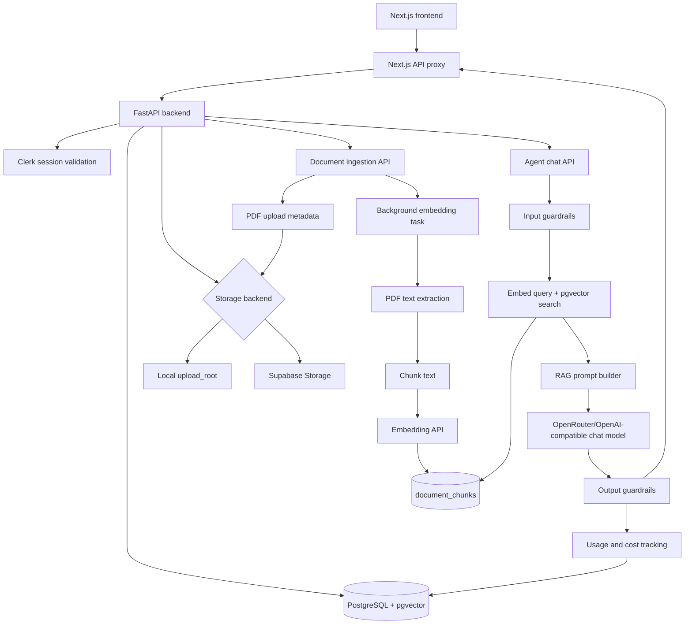

# Backend Design Decisions

## Architecture Diagram

## Decisions Made So Far

- FastAPI is the backend API layer, mounted under `/api/v1`.
- Clerk is the source of authenticated user identity. Backend routes require a valid Clerk session and mirror users locally.
- `Company` is the tenant boundary. Documents, chunks, chat retrieval, spend, and guardrail events are scoped by company.
- New agents require a name and email. Phone and description are optional for now, nullable in the database, and validated when provided.
- Agent descriptions are capped at 300 characters and displayed in the UI to clarify each agent's purpose before users upload documents or start a chat.
- PostgreSQL with pgvector is the production vector store. SQLite remains supported in tests through the portable `EmbeddingVector` type.
- The backend enables the pgvector extension during app startup when the configured database is PostgreSQL.
- SQLAlchemy ORM models define the current schema; Alembic exists for migrations that must repair or evolve live databases.
- Document uploads are PDF-only for MVP.
- Uploaded file bytes are stored outside the relational database, either in local `upload_root` storage or Supabase Storage.
- Supabase direct upload is supported with signed upload URLs to avoid sending large file bytes through the backend in production.
- `documents.file_content` is a legacy compatibility field. Searchable extracted text lives in `document_chunks`.
- Embedding runs as a FastAPI background task after upload or manual retry.
- Failed embeddings can be retried through the manual embed endpoint.
- Extraction, chunking, embedding, and chunk writes are separated into services so each step can be tested or replaced independently.
- RAG retrieval is deterministic: the backend embeds the user query and searches `document_chunks` directly before calling the LLM.
- Similarity thresholding happens before generation. If retrieval is weak or empty, the backend returns a fixed fallback instead of asking the LLM to guess.
- The answer model receives retrieved excerpts as the only source of truth.
- The chat prompt is intentionally concise: answer only what was asked, default to 1-3 short sentences, and avoid extra detail.
- Language selection is request-scoped. Supported chat languages are English, Swahili, French, Arabic, and Portuguese.
- The selected language is injected into the RAG prompt, and no-context fallbacks are localized without relying on the LLM.
- Input guardrails block oversized prompts before model calls.
- Output guardrails monitor replies for configured personal information patterns and write audit events.
- Usage and cost tracking records model and embedding charges per user when provider usage data is available.
- The frontend talks to the backend through Next.js API routes to keep browser calls same-origin and avoid direct CORS complexity.

## Current Backend Responsibilities

- Authenticate users and register local user rows.
- Manage tenant companies with name, email, optional phone contact details, and an optional short purpose description.
- Accept, validate, store, list, and confirm PDF document uploads.
- Extract PDF text, chunk it, embed it, and store vectors.
- Serve tenant-scoped RAG chat answers.
- Apply input and output guardrails.
- Track usage cost and expose monitoring data.

## Known Boundaries

- The backend does not provide emergency, legal, medical, or security advice as authoritative guidance.
- The backend does not currently filter documents by language; selected language affects answer wording, not retrieval scope.
- The backend does not persist user language preference. Language is supplied by each chat request.
- The backend avoids storing uploaded file bytes in PostgreSQL.
